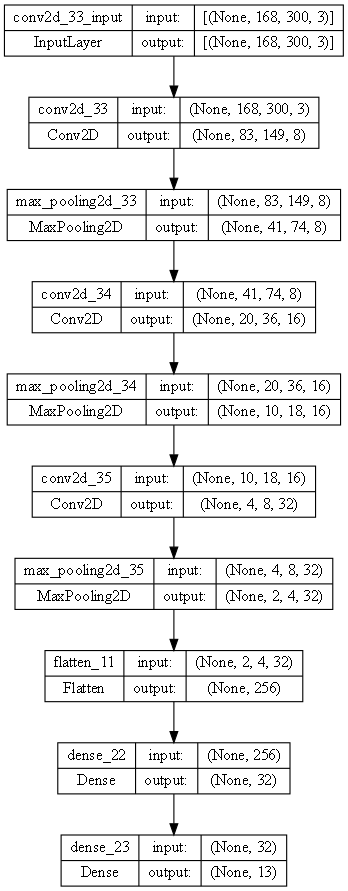

# Project from the subject of Deep Learning Fundamentals (DLF)

the goal of the project is to recognize different types of bars

## Dataset

The dataset can be downloaded from the [link](https://tulodz-my.sharepoint.com/:f:/g/personal/226448_edu_p_lodz_pl/ErTYyUaSHStElMGVoo-ZfGEBa-J5AVyXUHxcB4YfvS07jQ?e=4r0GNN).

The dataset consists of 4006 photos sized 3368x6000 pixels and has 13 classes: "Kinder", "Milka", "Bounty", "Twix", "Lion", "Snickers", "Roshen Red", "Roshen Green", " Crunchy", "Jeżyki", "Chałwa", "Chałwa kakaowa", "Mars".

Examples of samples of each class:

## Model

The neural network consists of 14 layers and has 840,000 parameters:

